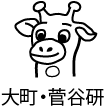

# **Tomo Miyazaki**

I am an Assistant Professor at Department of Communication Engineering at Tohoku University, Japan. I received my Ph.D. degree from Tohoku University and a B.S. from Yamagata University in 2011 and 2006, respectively.

# Physical Address
Email: tomo (at) tohoku.ac.jp  
Tel: +81-22-795-7088  
Fax: +81-22-795-7090  
Address: 6–6–05 Aoba Aramaki, Aoba, Sendai, 980–8579, Japan（仙台市青葉区荒巻字青葉6-6-05 電気系1号館 621号室）  
Lab Website: [Laboratory for Image Information Communications (In Japanese)](http://www.iic.ecei.tohoku.ac.jp/index.html)

# My Goals
1. Respect everyone
1. Work for neighbours
1. Refine myself (Stop comparing myself to others)

# Research
My research interests are in pattern recognition and image processing.
I am especially interested in recognizing visual objects with their structure.
Also structural data, such as chemical compounds, is my research target.

# Publications
- J. Masuho, <u>**T. Miyazaki**</u>, Y. Sugaya, [M. Omachi](https://researchmap.jp/read0055275) and S. Omachi  
"A Framework for Estimating Gaze Point Information for Location-Based Services"  
*IEEE Transactions on Vehicular Technology*, 2021 [**[paper]**](https://doi.org/10.1109/TVT.2021.3101932)
- K. Ogasawara, <u>**T. Miyazaki**</u>, Y. Sugaya, S. Omachi  
"Object-Based Video Coding by Visual Saliency and Temporal Correlation"  
*IEEE Transactions on Emerging Topics in Computing*, 2020 [**[paper]**](https://doi.org/10.1109/TETC.2017.2695640)
- <u>**T. Miyazaki**</u>, T. Tsuchiya, Y. Sugaya, S. Omachi, [M. Iwamura](http://www.m.cs.osakafu-u.ac.jp/~masa/index-e_old.shtml), [S. Uchida](http://human.ait.kyushu-u.ac.jp/~uchida/index-e.html), [K. Kise](http://www.m.cs.osakafu-u.ac.jp/~kise/index_e.html)  
"Automatic Generation of Typographic Font from a Small Font Subset"  
*IEEE Computer Graphics and Applications*, 2020 [**[paper]**](https://doi.org/10.1109/MCG.2019.2931431)  
- Y. Nagaoka, <u>**T. Miyazaki**</u>, Y. Sugaya,  S. Omachi  
"Automatic Mackerel Sorting Machine using Global and Local Features"  
*IEEE Access*, 2019 [**[paper]**](https://doi.org/10.1109/ACCESS.2019.2917554) [**[code]**](https://github.com/yoyoyo-yo/glcc-frcn.pytorch)
- <u>**T. Miyazaki**</u>, S. Omachi  
"Structural Data Recognition with Graph Model Boosting"  
*IEEE Access*, 2018 [**[paper]**](https://doi.org/10.1109/ACCESS.2018.2876860)  

[**Full list**](./publications.html)

# Professional Activity
Current:
- 大阪府立大学 文書解析・知識科学研究所 客員研究員 (Visiting Researcher at Institute of Document Analysis and Knowledge Science, IDAKS) 2018.4- [**[URL]**](https://www.osakafu-u.ac.jp/academics/orp/21c/idaks/)
- Program Committee Member, International Workshop on Historical Document Imaging and Processing (HIP),
[**[2021]**](https://blog.sbb.berlin/hip2021/#people)
[**[2019]**](https://www.primaresearch.org/hip2019/people)
[**[2017]**](http://events.unifr.ch/hip2017/people/)
[**[2015]**](http://hip2015.irisa.fr/people/)
- IJCAI-PRICAI PC Member [**2021**] [**[2020]**](https://ijcai20.org/pc_members/)
- PC Member ICDAR [**2021**]
- 専門委員，電子情報通信学会 画像工学研究会（IE）, 2019-2023
[**[Letter]**](./imgs/Letter_IE.pdf)
[**[URL]**](https://www.ieice.org/iss/ie/jpn/)

Previous:
- MIRU2020 組織 副委員長 [**[URL]**](https://sites.google.com/view/miru2020/%E3%83%9B%E3%83%BC%E3%83%A0/%E5%A7%94%E5%93%A1?authuser=0)
- 専門委員, 電子情報通信学会 パターン認識・メディア理解研究専門委員会（PRMU), 2015-2021
[**[Letter]**](./imgs/Letter_PRMU.pdf)
[**[URL]**](http://www.ieice.org/iss/prmu/jpn/yakuin.html)
[**[アルコン2017]**](https://sites.google.com/view/alcon2017prmu/)
[**[アルコン2019]**](https://sites.google.com/view/alcon2019)
- Program Committee Member, The 16th International Conference on
Frontiers in Handwriting Recognition (ICFHR), 2018 [**[URL]**](http://icfhr2018.org/organization.html)
- Publicity Chairs, The International Conference on Document Analysis and Recognition (ICDAR), 2017 [**[URL]**](http://u-pat.org/ICDAR2017/info_people.php)
- Local Arrangement Chair, The 2nd Student Organizing International Mini-Conference on Information Electronics
Systems (SOIM-GCOE2009), 2009
- MIRU2019 若手プログラム委員 [**[URL]**](http://cvim.ipsj.or.jp/MIRU2019/index.php?id=wakate-committee)

<!--
# Review Experience (newest first)
1. ICFHR2020
1. MIRU2020
1. IEEE Access
1. IJCAI-PRICAI2020
1. IEICE Transactions on Information and Systems
1. IEEE Transactions on Circuits and Systems for Video Technology (TCSVT)
1. IEEE Transaction on Image Processing (TIP)
1. International Journal on Document Analysis and Recognition (IJDAR)
1. Meeting on Image Recognition and Understanding (MIRU)
1. Journal of Circuits, Systems, and Computers
1. The International Conference on Frontiers in Handwriting Recognition
(ICFHR)
1. The International Workshop on Document Analysis System (DAS)
1. The Asian Conference on Pattern Recognition (ACPR)
-->

# Funding
1. Grant-in-Aid for Scientific Research ( B ), Co-Investigator, 20H04201, 2020-2023 [**[URL]**](https://kaken.nii.ac.jp/en/grant/KAKENHI-PROJECT-20H04201/)
1. Grant-in-Aid for Scientific Research ( C ), **Principal Investigator**, 19K11848, 2019-2021 [**[URL]**](https://kaken.nii.ac.jp/en/grant/KAKENHI-PROJECT-19K11848/)
1. Grant-in-Aid for Challenging Research ( Exploratory ), Co-Investigator, 18K19772, 2018-2021 [**[URL]**](https://kaken.nii.ac.jp/en/grant/KAKENHI-PROJECT-18K19772/)
1. Grant-in-Aid for Scientific Research ( C ), Co-Investigator, 18K11546, 2018-2021 [**[URL]**](https://kaken.nii.ac.jp/en/grant/KAKENHI-PROJECT-18K11546/)
1. Grant-in-Aid for Scientific Research ( B ), Co-Investigator, 16H02841, 2016-2019 [**[URL]**](https://kaken.nii.ac.jp/en/grant/KAKENHI-PROJECT-16H02841/)
1. Grant-in-Aid for Research Activity start-up, **Principal Investigator**, 15H06009, 2015-2016 [**[URL]**](https://kaken.nii.ac.jp/en/grant/KAKENHI-PROJECT-15H06009/)

<!--
1. 独立行政法人日本学術振興会, 科研費, 挑戦的研究()萌芽), 課題番号18K19772, 2018-
1. 独立行政法人日本学術振興会, 科研費, 基盤(B), 研究分担者, 課題番号16H02841, 2016-
1. 独立行政法人日本学術振興会, 科研費, 研究活動スタート支援, 研究代表者, 課題番号15H06009, 2015-2016
-->

<!--
# Reference
* [Grauman](http://www.cs.utexas.edu/~grauman/)
* [Greg](http://www.cs.sfu.ca/~mori/)
* [Alex burg](http://acberg.com/)
-->
