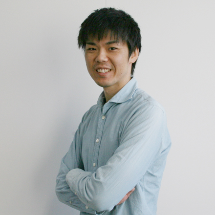

# **Tomo Miyazaki**

I am an Assistant Professor at Department of Communication Engineering at Tohoku University, Japan. I received my Ph.D. degree from Tohoku University and a B.S. from Yamagata University in 2011 and 2006, respectively.

# Physical Address
Emai: tomo (at) iic.ecei.tohoku.ac.jp  
Tel: +81-22-795-7088  
Fax: +81-22-795-7090  
Address: 6–6–05 Aoba Aramaki, Aoba, Sendai, 980–8579, Japan（仙台市青葉区荒巻字青葉6-6-05 電気系1号館 621号室）  
Website: [Laboratory for Image Information Communications (In Japanese)](http://www.iic.ecei.tohoku.ac.jp/index.html)

# Research
My research interests are in pattern recognition and image processing.
I am especially interested in recognizing visual objects with their structure.
Also structural data, such as chemical compounds, is my research target.

# Journal
1. <u>**Tomo Miyazaki**</u>, Shinichiro Omachi,  
"Structural Data Recognition with Graph Model Boosting,"  
IEEE Access, 2018　[**[paper]**](https://doi.org/10.1109/ACCESS.2018.2876860)  

1. Shun Chiba, <u>**Tomo Miyazaki**</u>, Yoshihiro Sugaya, Shinichiro Omachi,  
"Activity Recognition Using Gazed Text and Viewpoint Information for User Support Systems"  
Journal of Sensor and Actuator Networks, Volume 7, Issue 3, p.26, 2018 [**[paper]**](https://doi.org/10.3390/jsan7030031)

1. Airi Kitasato, <u>**Tomo Miyazaki**</u>, Yoshihiro Sugaya, Shinichiro Omachi,  
"Automatic Discrimination between Scomber japonicus and Scomber australasicus by Geometric and Texture Features"  
Fishes, Volume 3, Issue 3, p.26, 2018 [**[paper]**](https://doi.org/10.3390/fishes3030026)

1. Kazuya Ogasawara, <u>**Tomo Miyazaki**</u>, Yoshihiro Sugaya, Shinichiro Omachi,  
"Object-Based Video Coding by Visual Saliency and Temporal Correlation,"  
IEEE Transactions on Emerging Topics in Computing (TETC), 2017 [**[paper]**](https://doi.org/10.1109/TETC.2017.2695640)

1. <u>**Tomo Miyazaki**</u>, Tatsunori Tsuchiya, Yoshihiro Sugaya, Shinichiro Omachi, Masakazu Iwamura, Seiichi Uchida, Koichi Kise,  
"Automatic Generation of Typographic Font from a Small Font Subset,"  
[arXiv: 1701.05703](https://arxiv.org/abs/1701.05703), 2017

1. Yosuke Nozue, <u>**Tomo Miyazaki**</u>, Yoshihiro Sugaya, Shinichiro Omachi,  
"Efficient Coding for Video Including Text Using Image Generation,"  
Journal of Information Processing, vol.24, no.2, pp.330-338, 2016 [**[paper]**](https://doi.org/10.2197/ipsjjip.24.330)  

1. 川村 思織, <u>**宮崎 智**</u>, 菅谷 至寛, 大町 真一郎,  
"補助線を用いた情景画像からの高精度文字領域抽出,"  
画像電子学会誌, vol.45, no.1, pp.62-70, 2016 [**[paper]**](https://doi.org/10.11371/iieej.45.62)  

1. <u>**Tomo Miyazaki**</u>, Shinichiro Omachi,  
"Representative Graph Generation for Graph-Based Character Recognition,"  
The Journal of the Institute of Image Electronics Engineers of Japan, vol.40, no.3, pp.439-447, 2011 [**[paper]**](https://doi.org/10.11371/iieej.40.439)  

1. <u>**宮崎 智**</u>, 大町 真一郎, 阿曽 弘具,  
"重み付き最小共通スーパーグラフを用いたシルエット画像認識,"  
画像電子学会誌, vol.38, no.5, pp.640-647, 2009 [**[paper]**](https://doi.org/10.11371/iieej.38.640)

# International Conference (Refereed)
1. Yoshito Nagaoka, <u>**Tomo Miyazaki**</u>, Yoshihiro Sugaya,  Shinichiro Omachi  
"Mackerel Classification using Global and Local Features,"  
The 2018 IEEE 23rd International Conference on Emerging Technologies and Factory Automation (ETFA), p.1209-1212, 2018

1. Chisato Sugawara, <u>**Tomo Miyazaki**</u>, Yoshihiro Sugaya, Shinichiro Omachi  
"Text Retrieval for Japanese Historical Documents by Image Generation,"  
The 4th International Workshop on Historical Document Imaging and Processing (HIP), p.19-24, 2017 [**[paper]**](https://doi.org/10.1145/3151509.3151512)

1. Yoshito Nagaoka, <u>**Tomo Miyazaki**</u>, Yoshihiro Sugaya, Shinichiro Omachi  
"Text Detection by Faster R-CNN with Multiple Region Proposal Network,"  
International Workshop on Camera Based Document Analysis and Recognition (CBDAR), p.15-20, 2017 [**[paper]**](https://doi.org/10.1109/ICDAR.2017.343)

1. Yoshihiro Sugaya, Kento Takeda, <u>**Tomo Miyazaki**</u>, Shinichiro Omachi,  
"A Preliminary Study on Location Estimation without Preparation using Ceiling Signboard,"  
International Conference on Indoor Positioning and Indoor Navigation (IPIN), 179_WIP, 2017 [**[
paper]**](http://www.ipin2017.org/ipinpapers/179/179.pdf)  

1. Ofusa Kenichiro, <u>**Tomo Miyazaki**</u>, Yoshihiro Sugaya, Shinichiro Omachi,  
"Glyph-Based Data Augmentation for Accurate Kanji Character Recognition,"  
International Conference on Document Analysis and Recognition (ICDAR), p.597-602, 2017 [**[paper]**](https://doi.org/10.1109/ICDAR.2017.103)

1. Tomoya Honto, Yoshihiro Sugaya, <u>**Tomo Miyazaki**</u>, Shinichiro Omachi,  
"Analysis of Floor Map Image in Information Board for Indoor Navigation,"  
International Conference on Indoor Positioning and Indoor Navigation (IPIN), 144_RP, 2017 [**[paper]**](https://doi.org/10.1109/IPIN.2017.8115896)

1. Kiyoshiro Sakai, Yoshihiro Sugaya, <u>**Tomo Miyazaki**</u>, Shinichiro Omachi,  
"Development of Wearable System for Translation of Japanese Texts in the Environment,"  
Proceedings of International Workshop on Frontiers of Computer Vison (FCV), OS3-2, 2017

1. <u>**Tomo Miyazaki**</u>, Shinichiro Omachi,  
"Graph Model Boosting for Structural Data Recognition,"  
Proceedings of International conference of Pattern Recognition (ICPR), p.1708-1713, 2016 [**[paper]**](http://dx.doi.org/10.1109/ICPR.2016.7899882)  

1. Kento Tonosaki, Yoshihiro Sugaya, <u>**Tomo Miyazaki**</u>, Shinichiro Omachi,  
"Improvement of Map Matching for Indoor Navigation Exploiting Photo of Information Board,"  
Proceedings of International Conference on Indoor Positioning and Indoor Navigation (IPIN), p.22-26, 2016 [**[paper]**](http://www3.uah.es/ipin2016/usb/app/descargas/219_WIP.pdf)

1. Antoine Chauvet, <u>**Tomo Miyazaki**</u>, Yoshihiro Sugaya Shinichiro Omachi,  
"Adaptive Post Filter for Reducing Block Artifacts in High Efficiency Video Coding,"  
International Conference on Multimedia Systems and Signal Processing, 2016 [**[paper]**](http://dx.doi.org/10.1109/ICMSSP.2016.014)

1. Kento Tonosaki, Yoshihiro Sugaya, <u>**Tomo Miyazaki**</u>, Shinichiro Omachi,  
"Indoor Localization by Map Matching Using One Image of Information Board,"  
Proceedings of The Eighth International Conferences on Pervasive Patterns and Applications (PATTERNS), pp.22-26, 2016   
[**[Best Paper Award]**](http://www.iaria.org/conferences2016/AwardsPATTERNS16.html) [**[paper]**](http://www.thinkmind.org/index.php?view=article&articleid=patterns_2016_1_40_70039)

1. Kazuya Ogasawara, <u>**Tomo Miyazaki**</u>, Yoshihiro Sugaya, Shinichiro Omachi,  
"Object-based Video Coding for Arbitrary Shape by Visual Saliency and Temporal Correlation,"  
Proceedings of The Eighth International Conference on Creative Content Technologies (CONTENT), pp.13-16, 2016  
[**[Best Paper Award]**](http://www.iaria.org/conferences2016/AwardsCONTENT16.html) [**[paper]**](http://www.thinkmind.org/index.php?view=article&articleid=content_2016_1_30_60053)

1. Airi Kitasato, <u>**Tomo Miyazaki**</u>, Yoshihiro Sugaya, Shinichiro Omachi,  
"Discrimination of Scomber Japonicus and Scomber Australasicus by Dorsal Fin Length and Fork Length,"  
Proceedings of The 22nd Korea-Japan joint Workshop on Frontiers of Computer Vision (FCV), pp.338-341, 2016

1. Shuhei Toba, Hirotaka Kudo, <u>**Tomo Miyazaki**</u>, Yoshihiro Sugaya, Shinichiro Omachi,  
"Ultra-low Resolution Character Recognition System with Pruning Mutual Subspace Method,"  
Proceedings of International Conference on Consumer Electronics - Taiwan (ICCE-TW), pp.284-285, 2015 [**[paper]**](http://dx.doi.org/10.1109/ICCE-TW.2015.7216900)

1. Shun Chiba, <u>**Tomo Miyazaki**</u>, Yoshihiro Sugaya, Shinichiro Omachi,  
"Estimation of Gazing Points in Environment Using Eye Tracker and Omnidirectional Camera,"  
Proceedings of 2015 International Conference on Consumer Electronics - Taiwan (ICCE-TW), pp.47-48, 2015 [**[paper]**](http://dx.doi.org/10.1109/ICCE-TW.2015.7217003)

1. <u>**Tomo Miyazaki**</u>, Shinichiro Omachi,  
"Finding Stroke Parts for Rough Text Detection in Scene Images with Random Forest,"  
Proceedings of Joint Conference of IWAIT and IFMIA, 2015

1. <u>**Tomo Miyazaki**</u>, Shinichiro Omachi,  
"Fast Method for Extracting Representative Graph from Decorative Character Images,"  
Proceedings of IEEE International Conference on Network Infrastructures and Digital Content (IEEE IC-NIDC), pp.219-223, 2010 [**[paper]**](http://dx.doi.org/10.1109/ICNIDC.2010.5657776)

1. <u>**Tomo Miyazaki**</u>, Shinichiro Omachi, Hirotomo Aso,  
"Extraction of Representative Structure of Decorative Character Images,"  
Proceedings of the Chinese Conference on Pattern Recognition (CCPR) and the First CJK Joint Workshop on Pattern Recognition (CJKPR), vol.2, pp.944-948, 2009 [**[paper]**](http://dx.doi.org/10.1109/CCPR.2009.5343952)

1. <u>**Tomo Miyazaki**</u>, Shinichiro Omachi, Hirotomo Aso,  
"Extraction of Structure of Silhouette Images by Weighted Minimum Common Supergraph,"  
Proceedings of the Second Korea-Japan Joint Workshop on Pattern Recognition (KJPR), pp.57-61, 2007

# International Conference (Non-refereed)

1. Kyoko Maeda, <u>**Tomo Miyazaki**</u>, Yoshihiro Sugaya, Shinichiro Omachi,  
"Investigation of Convolutional Neural Network Structure for Low Resolution Character Recognition,"  
International Workshop on Emerging ICT, 2016

1. Kota Oodaira, <u>**Tomo Miyazaki**</u>, Yoshihiro Sugaya, Shinichiro Omachi,  
"Detection of a Key String from Scene Images Using Saliency,"  
International Workshop on Emerging ICT, 2016

1. <u>**Tomo Miyazaki**</u>, Shinichiro Omachi,  
"Rough Detection of Text in Scene Images by Finding Stroke Parts,"  
Proceedings of the International Workshop on Electronics and Communications, Oral Session 4, 2014

1. Jian Wang, Hiroya Saito, <u>**Tomo Miyazaki**</u>, Yoshihiro Sugaya, Shinichiro Omachi,  
"Automatic Synthesis of Character Pattern Using Patch Transform,"  
Proceedings of the International Workshop on Electronics and Communications, Oral Session 1, 2014

1. <u>**Tomo Miyazaki**</u>, Shinichiro Omachi,  
"Extracting Representative Graph of Decorative Character Images by Random Method,"   
Proceedings of the Third Student Organizing International Mini-Conference on Information Electronics Systems, pp.67–68, 2010

1. <u>**Tomo Miyazaki**</u>, Shinichiro Omachi,  
“Iterative Extraction of Representative Graph Using
Common Features from Decorative Character Images,”  
Proceedings of the Second Student Organizing International Mini-Conference on Information Electronics Systems,
pp.85–86, 2009

1. <u>**Tomo Miyazaki**</u>, Shinichiro Omachi, Hirotomo Aso,  
"Silhouette Image Recognition,"  
Proceedings of the Third Korea-Japan Joint Workshop on Pattern Recognition, pp.13–
14, 2008

1. <u>**Tomo Miyazaki**</u>, Shinichiro Omachi, Hirotomo Aso,  
"Structure Extraction from Silhouette Images by Weighted Minimum Common Supergraph,"  
Proceedings of the First Student Organizing International Mini-Conference on Information Electronics Systems, pp.75–76, 2008

1. <u>**Tomo Miyazaki**</u>, Shinichiro Omachi, Hirotomo Aso,  
"Extraction of Structure of Shapes Using Weighted Minimum Common Supergraph,"   
Proceedings of the China-Korea-Japan Graduates Workshop on Electronic Information, pp.49–50, 2008

# Domestic (Non-refereed)
1. 黄 希, <u>**宮崎 智**</u>, 菅谷 至寛, 大町 真一郎,  
"Multi-Frame Super Resolution Using 3D Convolution and RNN Prediction,"  
平成30年度電気関係学会東北支部連合大会講演論文集, 2F12, 2018

1. 桑野 拓朗, <u>**宮崎 智**</u>, 菅谷 至寛, 大町 真一郎,  
"超解像を用いた動画像符号化に関する検討,"  
平成30年度電気関係学会東北支部連合大会講演論文集, 1D14, 2018

1. 増保 純平, <u>**宮崎 智**</u>, 菅谷 至寛, 大町 真一郎,  
"監視カメラを活用したユーザの実世界位置の推定,"  
平成30年度電気関係学会東北支部連合大会講演論文集, 1I05, 2018

1. 竹村 貴文, 菅谷 至寛, <u>**宮崎 智**</u>, 大町 真一郎,  
"天吊り案内板を用いた屋内ナビゲーション手法の検討,"  
平成30年度電気関係学会東北支部連合大会講演論文集, 2A07, 2018

1. 佐藤 大亮, <u>**宮崎 智**</u>, 菅谷 至寛, 大町 真一郎  
"Determining Important Objects in Scene Image Using Neural Networks,"  
平成29年度電気関係学会東北支部連合大会講演論文集, 2B12, 2017  
[**[The Encouragement Prize]**](http://www.ecei.tohoku.ac.jp/ieee-sendai/index.php)

1. 八重樫 日菜子, <u>**宮崎 智**</u>, 菅谷 至寛, 大町 真一郎,  
"スパースコーディングを用いた動画像符号化に関する検討,"  
電子情報通信学会総合大会学生ポスターセッション, ISS-SP-200, 2017

1. 大平 康太, <u>**宮崎 智**</u>, 菅谷 至寛, 大町 真一郎,  
"重要度を考慮した情景画像中における文字情報抽出,"  
電子情報通信学会総合大会学生ポスターセッション, ISS-SP-199, 2017

1. 坂井 清士郎, <u>**宮崎 智**</u>, 菅谷 至寛, 大町 真一郎,  
"文字認識を利用した環境中の日本語英字翻訳を行うウェアラブルシステムの開発,"  
平成28年度電気関係学会東北支部連合大会講演論文集, 2G04, 2016

1. Kyoko Maeda, <u>**Tomo Miyazaki**</u>, Yoshihiro Sugaya, Shinichiro Omachi,  
"Low Resolution Character Recognition Using Convolutional Neural Networks,"  
平成28年度電気関係学会東北支部連合大会講演論文集, 1A04, 2016

1. Kenta Takeda, Yoshihiro Sugaya, <u>**Tomo Miyazaki**</u>, Shinichiro Omachi,  
"Signboard Extraction and Recognition in Subway Station Premises,"  
平成28年度電気関係学会東北支部連合大会講演論文集, 1A03, 2016

1. 井上 慶祐, <u>**宮崎 智**</u>, 菅谷 至寛, 大町 真一郎,  
"スパースコーディングを用いたテキストを含む画像符号化に関する検討,"  
電子情報通信学会技術研究報告, IE2016-36, vol.116, no.119, pp.5-10, 2016

1. 景山 竣, <u>**宮崎 智**</u>, 菅谷 至寛, 大町 真一郎,  
"パーツの生成による少数サンプルからのフォント生成,"  
画像の認識・理解シンポジウム (MIRU), PS3-08, 2016

1. 大平 康太, <u>**宮崎 智**</u>, 菅谷 至寛, 大町 真一郎,  
"顕著性を利用した情景画像からの重要な文字列の検出,"  
画像の認識・理解シンポジウム (MIRU), PS3-42, 2016

1. Toshiaki Sakai, <u>**Tomo Miyazaki**</u>, Yoshihiro Sugaya, Shinichiro Omachi,  
"Graph Learning with Quadratic Programming in Consideration of Class Diversity,"  
画像の認識・理解シンポジウム (MIRU), PS2-42, 2016

1. 酒井 利晃, <u>**宮崎 智**</u>, 菅谷 至寛, 大町 真一郎,  
"非線形最小化によるグラフのモデルの構築と画像認識,"  
電子情報通信学会2016年総合大会講演論文集, D-12-96, 2016

1. Shuto Shinbo, <u>**Tomo Miyazaki**</u>, Yoshihiro Sugaya, Shinichiro Omachi,  
"Accuracy Improvement of Character Recognition Using Generated Samples by Morphing,"  
平成27年度電気関係学会東北支部連合大会講演論文集, 2A12, 2015  
[**[The Best Paper Prize]**](http://www.ecei.tohoku.ac.jp/ieee-sendai/event/2015.html)

1. Shun Chiba, <u>**Tomo Miyazaki**</u>, Yoshihiro Sugaya, Shinichiro Omachi,  
"Gaze Detection in Omnidirectional Scene by Iterative Image Matching,"  
平成27年度電気関係学会東北支部連合大会講演論文集, 2A11, 2015

1. Kento Tonosaki, Yoshihiro Sugaya, <u>**Tomo Miyazaki**</u>, Shinichiro Omachi,  
"Survey of Guide Plates and Fundamental Study of Map Image Analysis for Indoor Navigation,"  
平成27年度電気関係学会東北支部連合大会講演論文集, 1E05, 2015

1. 小笠原 和也, <u>**宮崎 智**</u>, 菅谷 至寛, 大町 真一郎,  
"顕著性マップとGrabCutによる注目物体抽出を用いた動画像符号化,"  
平成27年度電気関係学会東北支部連合大会講演論文集, 2D10, 2015

1. 千葉 駿, <u>**宮崎 智**</u>, 菅谷 至寛, 大町 真一郎,  
"アイトラッカと全方位カメラを用いた環境中の視点位置推定,"  
電子情報通信学会技術研究報告, PRMU2014-134, vol.114, no.454, pp.101-102, 2015

1. 大島 康嗣, <u>**宮崎 智**</u>, 菅谷 至寛, 大町 真一郎,  
"ストローク幅特徴を用いた情景画像中の文字検出,"  
電子情報通信学会技術研究報告, PRMU2014-133, vol.114, no.454, pp.99-100, 2015

1. 石森 亮輔, <u>**宮崎 智**</u>, 菅谷 至寛, 大町 真一郎,  
"画像抽象化による分割圧縮効果改善の検討,"  
電子情報通信学会技術研究報告, PRMU2014-132, vol.114, no.454, pp.97-98, 2015

1. 鳥羽 修平, 工藤 裕貴, <u>**宮崎 智**</u>, 菅谷 至寛, 大町 真一郎,  
"動画像を用いた超低解像度文字認識,"  
電子情報通信学会技術研究報告, PRMU2014-131, vol.114, no.454, pp.95-96, 2015

1. 吉田 大樹, <u>**宮崎 智**</u>, 菅谷 至寛, 大町 真一郎,  
"電子基板の欠陥検査のための文字認識,"  
平成27年度電気関係学会東北支部連合大会講演論文集, 1E06, 2015

1. 川村 思織, <u>**宮崎 智**</u>, 菅谷 至寛, 大町 真一郎,  
"補助線を利用した文字領域抽出,"  
電子情報通信学会技術研究報告, PRMU2013-152, vol.113, no.431, pp.119-120, 2014

1. 石森 亮輔, <u>**宮崎 智**</u>, 菅谷 至寛, 大町 真一郎,  
"オブジェクトベースの符号化のための画像抽象化を用いた分割圧縮,"  
画像符号化シンポジウム予稿集, P-4-11, 2014

1. 野末 洋佑, <u>**宮崎 智**</u>, 菅谷 至寛, 大町 真一郎,  
"文字パラメータを利用した動画像中の文字の高効率符号化,"  
画像符号化シンポジウム予稿集, P-2-11, 2014

1. Shuhei Toba, Hirotaka Kudo, <u>**Tomo Miyazaki**</u>, Yoshihiro Sugaya, Shinichiro Omachi,  
"Ultra-Low Resolution Character Recognition with Increased Training Data and Image Enhancement,"  
平成26年度電気関係学会東北支部連合大会講演論文集, 2A18, 2014

1. Tatsunori Tsuchiya, <u>**Tomo Miyazaki**</u>, Yoshihiro Sugaya, Shinichiro Omachi,  
"Automatic Generation of Kanji Fonts from Sample Designs,"  
平成26年度電気関係学会東北支部連合大会講演論文集, 2A17, 2014

1. Yosuke Nozue, <u>**Tomo Miyazaki**</u>, Yoshihiro Sugaya, Shinichiro Omachi,  
"A Video Coding Method for Scene Text,"  
平成26年度電気関係学会東北支部連合大会講演論文集, 2A19, 2014

1. 石森 亮輔, <u>**宮崎 智**</u>, 菅谷 至寛, 大町 真一郎,  
"抽象化を用いた画像圧縮のための領域分割,"  
平成26年度電気関係学会東北支部連合大会講演論文集, 2H14, 2014

1. 大島 康嗣, <u>**宮崎 智**</u>, 菅谷 至寛, 大町 真一郎,  
"全方位情景画像のための2段階文字列検出,"  
画像の認識・理解シンポジウム (MIRU), SS1-42, 2014

1. 鳥羽 修平, 工藤 裕貴, <u>**宮崎 智**</u>, 菅谷 至寛, 大町 真一郎,  
"ぼけ除去及び複数フレームを利用した超低解像度文字認識,"  
画像の認識・理解シンポジウム (MIRU), SS2-50, 2014

1. 土屋 達徳, <u>**宮崎 智**</u>, 菅谷 至寛, 大町 真一郎,  
"サンプルデザインからの漢字フォントの自動生成,"  
画像の認識・理解シンポジウム (MIRU), SS3-17, 2014

1. 川村 思織, <u>**宮崎 智**</u>, 菅谷 至寛, 大町 真一郎,  
"補助線を利用した文字領域抽出,"  
画像の認識・理解シンポジウム (MIRU), SS3-45, 2014

1. <u>**Tomo Miyazaki**</u>, Shinichiro Omachi, Hirotomo Aso,  
"Structure Extraction from Multiple Decorative Character Images,"  
平成21年度電気関係学会東北支部連合大会講演論文集, 2A-11, 2009  
[The Best Paper Prize](http://www.ecei.tohoku.ac.jp/ieee-sendai/event/2009.html)

1. <u>**宮崎 智**</u>, 大町 真一郎, 阿曽 弘具,  
"共通拡大グラフによる飾り文字画像群からの文字構造抽出,"  
画像の認識・理解シンポジウム論文集, IS1-16, pp.506-512, 2009

1. <u>**宮崎 智**</u>, 大町 真一郎, 阿曽 弘具,  
"重み付き最小共通スーパーグラフによるシルエット画像の構造抽出,"  
画像の認識・理解シンポジウム論文集, IS5-3, pp.1408-1413, 2008

# Misc
1. <u>**宮崎 智**</u>, 川村 思織, 菅谷 至寛, 大町 真一郎,  
"ユーザ入力の補助線による情景画像からの高精度文字抽出",  
画像ラボ, 2017年10月号

1. <u>**Tomo Miyazaki**</u>, Shinichiro Omachi,  
"Structural Data Recognition with Graph Model Boosting,"  
[arXiv: 1703.02662](https://arxiv.org/abs/1703.02662), 2017

# Exhibition
1. 全方位文字認識技術（全方位に存在する文字を高精度かつリアルタイムに認識するデモシス
テム）の出展, 最先端IT・エレクトロニクス総合展（CEATEC JAPAN）, 2014 年10 月
7–8 日
1. コンピュータと人が融和する文字・文書メディアの利用技術（超低解像度文字を高精度に認
識するデモシステム）の出展, 東北大学イノベーションフェア, 2014 年1 月28 日
1. 人間調和型の文字検出および認識手法（人間が見た文字を検出し認識するデモシステム）の
出展, 東北大学電気・情報東京フォーラム, 2013 年11 月25 日

# Awards
1. The Eighth International Conferences on Pervasive Patterns and Applications, Best Paper Award (March 22, 2016)  
Kento Tonosaki, Yoshihiro Sugaya, <u>**Tomo Miyazaki**</u>, Shinichiro Omachi,  
"Indoor Localization by Map Matching Using One Image of Information Board,"  
Proceedings of The Eighth International Conferences on Pervasive Patterns and Applications (PATTERNS), pp.22-26, 2016 [**[URL]**](http://www.iaria.org/conferences2016/AwardsPATTERNS16.html)   

1. The Eighth International Conferences on Creative Content Technologies, Best Paper Award (March 22, 2016)  
Kazuya Ogasawara, <u>**Tomo Miyazaki**</u>, Yoshihiro Sugaya, Shinichiro Omachi,  
"Object-based Video Coding for Arbitrary Shape by Visual Saliency and Temporal Correlation,"  
Proceedings of The Eighth International Conference on Creative Content Technologies (CONTENT), pp.13-16, 2016 [**[URL]**](http://www.iaria.org/conferences2016/AwardsCONTENT16.html)  

1. IEEE Sendai Section, The Best Paper Prize (December 7, 2009)  
<u>**Tomo Miyazaki**</u>, Shinichiro Omachi, Hirotomo Aso,  
"Structure Extraction from Multiple Decorative Character Images,"  
Tohoku-Section Joint Convention Record of Institutes of Electrical and Information Engineers, 2A-11, 2009 [**[URL]**](http://www.ecei.tohoku.ac.jp/ieee-sendai/event/2009.html)

# Patent
1. 菅谷 至寛, 外崎 健人, 大町 真一郎, 宮崎 智,  
"情報端末、位置推定方法、および位置推定プログラム,"  
特願2016-056139

# Professional Service
1. Program Committee Member, The 16th International Conference on
Frontiers in Handwriting Recognition (ICFHR), 2018 [**[URL]**](http://icfhr2018.org/organization.html)
1. Publicity Chairs, The International Conference on Document Analysis and Recognition (ICDAR), 2017 [**[URL]**](http://u-pat.org/ICDAR2017/info_people.php)
1. Program Committee Member, International Workshop on Historical Document Imaging and Processing (HIP), [**[2015]**](http://hip2015.irisa.fr/people/), [**[2017]**](http://events.unifr.ch/hip2017/people/)
1. Local Arrangement Chair, The 2nd Student Organizing International Mini-Conference on Information Electronics
Systems (SOIM-GCOE2009), 2009
1. 専門委員, パターン認識・メディア理解研究専門委員会（PRMU), 2015-

# Review Experience
1. IEEE Transactions on Circuits and Systems for Video Technology, 2018
1. IEEE Access, 2017
1. IEICE Transactions on Information and Systems, 2015-2018
1. MIRU, 2017
1. IEEE Transaction on Image Processing (TIP), 2016
1. IEICE Transactions on Information and Systems, 2016
1. Journal of Circuits, Systems, and Computers, 2015-2016
1. International Journal on Document Analysis and Recognition (IJDAR), 2014
1. The International Conference on Frontiers in Handwriting Recognition
(ICFHR), 2014, 2018
1. The International Workshop on Document Analysis System (DAS), 2014
1. The Asian Conference on Pattern Recognition (ACPR), 2013

# Funding
1. Grant-in-Aid for Challenging Research (Exploratory), Co-Investigator, No.16H02841, 2018-2021 [**[URL]**](https://kaken.nii.ac.jp/en/grant/KAKENHI-PROJECT-18K19772/)
1. Grant-in-Aid for Scientific Research (C), Co-Investigator, No.18K11546, 2018-2021 [**[URL]**](https://kaken.nii.ac.jp/en/grant/KAKENHI-PROJECT-18K11546/)
1. Grant-in-Aid for Scientific Research (B), Co-Investigator, No.16H02841, 2016-2019 [**[URL]**](https://kaken.nii.ac.jp/en/grant/KAKENHI-PROJECT-16H02841/)
1. Grant-in-Aid for Research Activity start-up, Principal Investigator, No.15H06009, 2015-2016 [**[URL]**](https://kaken.nii.ac.jp/en/grant/KAKENHI-PROJECT-15H06009/)

<!--
1. 独立行政法人日本学術振興会, 科研費, 挑戦的研究()萌芽), 課題番号18K19772, 2018-
1. 独立行政法人日本学術振興会, 科研費, 基盤(B), 研究分担者, 課題番号16H02841, 2016-
1. 独立行政法人日本学術振興会, 科研費, 研究活動スタート支援, 研究代表者, 課題番号15H06009, 2015-2016
-->

<!--
# Reference
* [Grauman](http://www.cs.utexas.edu/~grauman/)
* [Greg](http://www.cs.sfu.ca/~mori/)
* [Alex burg](http://acberg.com/)
-->
