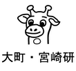

# **Tomo Miyazaki**

I am an Assistant Professor at Department of Communication Engineering at Tohoku University, Japan. I received my Ph.D. degree from Tohoku University and a B.S. from Yamagata University in 2011 and 2006, respectively.

# Physical Address

Email: tomo (at) tohoku.ac.jp  
Tel: +81-22-795-7088  
Fax: +81-22-795-7090  
Address: 6–6–05 Aoba Aramaki, Aoba, Sendai, 980–8579, Japan（仙台市青葉区荒巻字青葉6-6-05 電気系1号館 621号室）  
Lab Website: [Laboratory for Image Information Communications (In Japanese)](http://www.iic.ecei.tohoku.ac.jp/index.html)

# My Goals

1. Respect everyone. Grades of jobs and place do not matter. [Ourself matter](https://www.churchofjesuschrist.org/study/general-conference/2011/10/you-matter-to-him?lang=eng&id=p31#p31).
2. Work optimistically. Things will work out.
3. Be patient. Don't become disappointed when things don't work out exactly as planned.
4. Be persistent. Keep working even when things get difficult. Push through the tough time. 
5. Refine myself. Stop comparing myself to others.

# Research

My research interests are in pattern recognition and image processing.
I am especially interested in recognizing visual objects with their structure.
Also structural data, such as chemical compounds, is my research target.

# Publications

- [A Scene-Text Synthesis Engine Achieved Through Learning from Decomposed Real-World Data](https://doi.org/10.1109/TIP.2023.3326685), *IEEE TIP*, 2023
- [Deep Image Compression Using Scene Text Quality Assessment](https://doi.org/10.1016/j.patcog.2023.109696), *PR*, 2023  
- [Important Region Estimation Using Image Captioning](https://doi.org/10.1109/ACCESS.2022.3211260), *IEEE Access*, 2022
- [Mackerel Fat Content Estimation using RGB and Depth Images](https://doi.org/10.1109/ACCESS.2021.3134260), *IEEE Access*, 2021
- [Stroke-Based Scene Text Erasing Using Synthetic Data for Training](https://doi.org/10.1109/TIP.2021.3125260), *IEEE TIP*, 2021
- [A Framework for Estimating Gaze Point Information for Location-Based Services](https://doi.org/10.1109/TVT.2021.3101932), *IEEE TVT*, 2021
- [Object-Based Video Coding by Visual Saliency and Temporal Correlation](https://doi.org/10.1109/TETC.2017.2695640), *IEEE TETC*, 2020
- [Automatic Generation of Typographic Font from a Small Font Subset](https://doi.org/10.1109/MCG.2019.2931431), *IEEE CG&A*, 2020
- [Automatic Mackerel Sorting Machine using Global and Local Features](https://doi.org/10.1109/ACCESS.2019.2917554), *IEEE Access*, 2019
- [Structural Data Recognition with Graph Model Boosting](https://doi.org/10.1109/ACCESS.2018.2876860), *IEEE Access*, 2018

[**Full list**](./publications.html)

# Professional Activity

Current:

- 大阪府立大学 文書解析・知識科学研究所 客員研究員 (Visiting Researcher at Institute of Document Analysis and Knowledge Science, IDAKS) 2018.4- [**[URL]**](https://www.osakafu-u.ac.jp/academics/orp/21c/idaks/)
- 専門委員，電子情報通信学会 画像工学研究会（IE）, 2019-2025
  [**[Letter]**](./imgs/Letter_IE.pdf)
  [**[URL]**](https://www.ieice.org/iss/ie/jpn/)
- Program Committee Member, International Workshop on Historical Document Imaging and Processing (HIP),
  [**[2023]**](https://blog.sbb.berlin/hip2023/#people) [**[2021]**](https://blog.sbb.berlin/hip2021/#people) [**[2019]**](https://www.primaresearch.org/hip2019/people) [**[2017]**](http://events.unifr.ch/hip2017/people/) [**[2015]**](http://hip2015.irisa.fr/people/)

Previous:

- IJCAI-PRICAI PC Member [**[2021]**](https://ijcai-21.org/program-committee-members/) [**[2020]**](https://ijcai20.org/pc_members/)
- PC Member ICDAR, 2021
- MIRU2020 組織 副委員長 [**[URL]**](https://sites.google.com/view/miru2020/%E3%83%9B%E3%83%BC%E3%83%A0/%E5%A7%94%E5%93%A1?authuser=0)
- 専門委員, 電子情報通信学会 パターン認識・メディア理解研究専門委員会（PRMU), 2015-2021
  [**[Letter]**](./imgs/Letter_PRMU.pdf)
  [**[URL]**](http://www.ieice.org/iss/prmu/jpn/yakuin.html)
  [**[アルコン2017]**](https://sites.google.com/view/alcon2017prmu/)
  [**[アルコン2019]**](https://sites.google.com/view/alcon2019)
- Program Committee Member, The 16th International Conference on
  Frontiers in Handwriting Recognition (ICFHR), 2018 [**[URL]**](http://icfhr2018.org/organization.html)
- Publicity Chairs, The International Conference on Document Analysis and Recognition (ICDAR), 2017 [**[URL]**](http://u-pat.org/ICDAR2017/info_people.php)
- Local Arrangement Chair, The 2nd Student Organizing International Mini-Conference on Information Electronics
  Systems (SOIM-GCOE2009), 2009
- MIRU2019 若手プログラム委員 [**[URL]**](http://cvim.ipsj.or.jp/MIRU2019/index.php?id=wakate-committee)

# Funding

1. Grant-in-Aid for Scientific Research (C), **Principal Investigator**, 22K12729, 2022-2024 [**[URL]**](https://kaken.nii.ac.jp/en/grant/KAKENHI-PROJECT-22K12729/)
2. Grant-in-Aid for Scientific Research ( B ), Co-Investigator, 20H04201, 2020-2023 [**[URL]**](https://kaken.nii.ac.jp/en/grant/KAKENHI-PROJECT-20H04201/)
3. Grant-in-Aid for Scientific Research ( C ), **Principal Investigator**, 19K11848, 2019-2021 [**[URL]**](https://kaken.nii.ac.jp/en/grant/KAKENHI-PROJECT-19K11848/)
4. Grant-in-Aid for Challenging Research ( Exploratory ), Co-Investigator, 18K19772, 2018-2021 [**[URL]**](https://kaken.nii.ac.jp/en/grant/KAKENHI-PROJECT-18K19772/)
5. Grant-in-Aid for Scientific Research ( C ), Co-Investigator, 18K11546, 2018-2021 [**[URL]**](https://kaken.nii.ac.jp/en/grant/KAKENHI-PROJECT-18K11546/)
6. Grant-in-Aid for Scientific Research ( B ), Co-Investigator, 16H02841, 2016-2019 [**[URL]**](https://kaken.nii.ac.jp/en/grant/KAKENHI-PROJECT-16H02841/)
7. Grant-in-Aid for Research Activity start-up, **Principal Investigator**, 15H06009, 2015-2016 [**[URL]**](https://kaken.nii.ac.jp/en/grant/KAKENHI-PROJECT-15H06009/)

<!--
# Reference
* [Grauman](http://www.cs.utexas.edu/~grauman/)
* [Greg](http://www.cs.sfu.ca/~mori/)
* [Alex burg](http://acberg.com/)
-->
